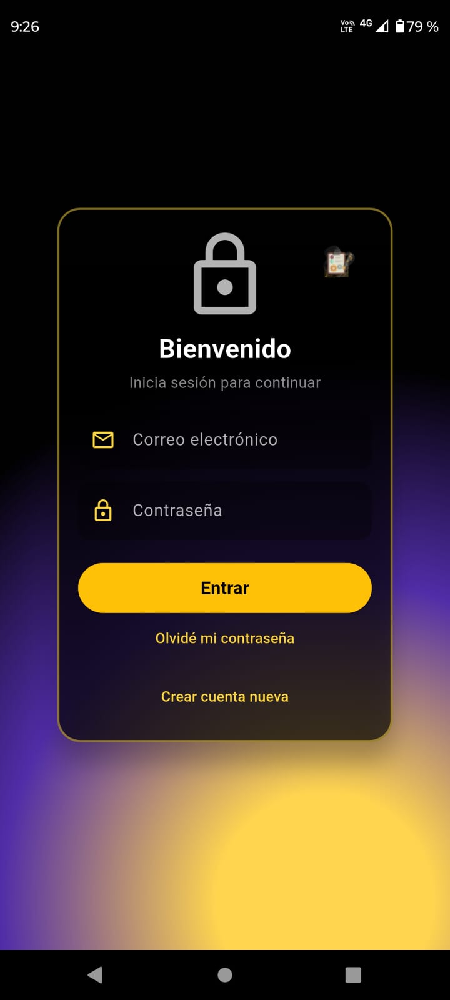

# Taskify
---

  

  <em>Gestor inteligente de tareas diseñado para mantenerte enfocado y productivo.</em>

---

## 🎨 Diseño y Concepto

Taskify fue diseñado pensando en la **simplicidad y la eficiencia**:  
- Interfaz minimalista y amigable 🌙  
- Colores elegidos para comodidad visual  
- Animaciones sutiles para mejorar la experiencia de usuario  

---

## 🚀 Características Principales

- 🔒 **Autenticación con Firebase**  
- 🔔 **Notificaciones y recordatorios inteligentes**  
- 📁 **Gestión de tareas y categorías**  
- 🌙 **Modo oscuro**  

---

## 📦 Descargar la App

  <a href="https://github.com/Nini09-19/Taskify/releases/download/v1.0.0/Taskify_v1.0.apk"
     style="background-color:#43A047; color:white; padding:12px 24px; border-radius:8px; text-decoration:none; font-weight:bold;">
     📦 Descargar Taskify v1.0.0 (.apk)
  </a>

  
    💡 *Requiere Android 8.0 o superior. Permitir instalar aplicaciones de fuentes desconocidas si es necesario.* 
    *Si no recibes notificaciones, asegúrate de activarlas desde la sección "Acerca de la aplicación".*
  

---

## 🧩 Tecnologías Usadas

| Tecnología | Uso |
|------------|-----|
| Flutter    | Desarrollo de la app |
| Firebase   | Autenticación, Firestore, FCM |
| Dart       | Lenguaje principal |

---

## 👨‍💻 Equipo de Desarrollo

**Homero y Armando** – Diseño y Flutter  
**Alejandro** – Gestión de tareas y pruebas  
**Yosgard** – UX/UI, planificación y soporte  

---

## 📸 Capturas de Pantalla

| Login | Dashboard |
|-------|-----------|
|  |  |

---

## 🛠️ Próximas mejoras

- Integración con Widgets para acceso rápido desde la pantalla principal  
- Recomendaciones inteligentes para priorizar tareas  
- Mejoras de rendimiento y optimización de animaciones  

---

> 📝 *Este README refleja cómo diseñamos Taskify y todas sus funcionalidades principales.*
